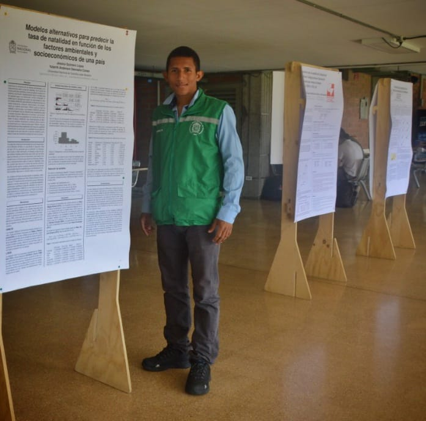

<br>
<hr>
<p><center>
### <span style="color:blue"> <strong> <em>¡Hola mundo! Bienvenido a mi página web </em> <strong>
<div align="right">
<i></i>
</div>
</center></p>
<hr>

```{r fig.asp=0.70, echo=FALSE, fig.align='center', out.width="350", out.height="350"}

```

<br>
<hr>
<strong><p><center>Copyright &copy; 2021, webpage made with Rmarkdown.</center></p><strong>
<hr>