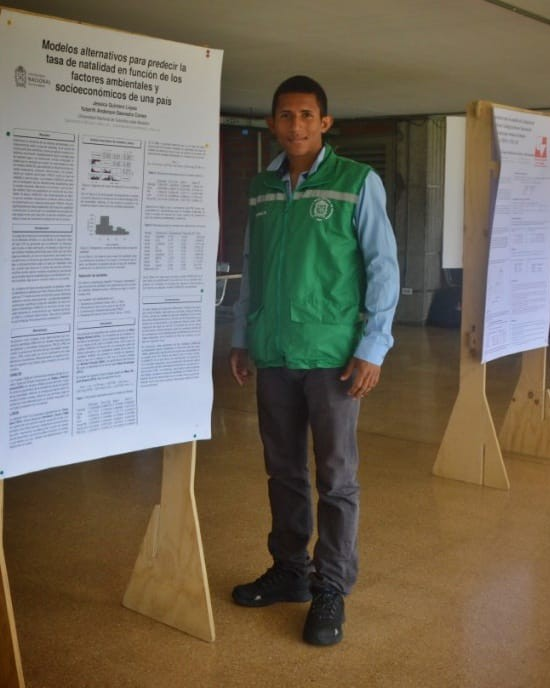

::: {.home-wrapper}

::: {.hero-modern}

::: {.hero-copy}

ESTADÍSTICA · CIENCIA DE DATOS · ANALÍTICA · IA · ECONOMÍA

Yuberth A. Saavedra

De lo finito de los datos a lo infinito de las preguntas.

Estadístico y especialista en Analítica y Big Data, con experiencia en **ciencia de datos, inteligencia de negocio, modelación predictiva y automatización**.

“The infinite! No other question has ever moved so profoundly the spirit of man.”
— David Hilbert

<a href="projects.html" class="btn btn-primary">Explorar proyectos</a>
<a href="about.html" class="btn btn-outline-secondary">Conocer mi perfil</a>

Python
R
SQL
Power BI
Machine Learning
Econometría

:::

::: {.hero-visual}

<strong>Analítica y liderazgo</strong>
Datos para apoyar mejores decisiones

<strong>Aprendizaje continuo</strong>
Datos, IA e innovación

<strong>Investigación y divulgación</strong>
Estadística aplicada y conocimiento

<button class="dot active" aria-label="Foto 1"></button>
<button class="dot" aria-label="Foto 2"></button>
<button class="dot" aria-label="Foto 3"></button>

:::

:::

## Lo que hago

::: {.area-grid}

::: {.feature-card}
### Ciencia de Datos
Modelos predictivos, clasificación, segmentación y series de tiempo aplicados a problemas reales.
:::

::: {.feature-card}
### Analítica & BI
Indicadores, tableros y visualización para monitorear resultados y apoyar decisiones.
:::

::: {.feature-card}
### Automatización & IA
Procesos analíticos reproducibles y automatizados con R, Python, SQL e inteligencia artificial.
:::

::: {.feature-card}
### Estadística & Economía
Modelación estadística, pronóstico, econometría e inferencia para comprender relaciones y escenarios.
:::

:::

## Impacto

::: {.metric-grid}

::: {.metric-card}
### +12 %
**Precisión de pronósticos**

Mejora lograda mediante nuevas metodologías de estimación y seguimiento.
:::

::: {.metric-card}
### ~$350 M
**Precisión en proyección de recaudo**

Reducción aproximada de la desviación promedio de las proyecciones.
:::

::: {.metric-card}
### 77 %
**Desempeño predictivo**

Resultado alcanzado en modelos de clasificación para priorización de clientes.
:::

:::

## Explora mi trabajo

::: {.explore-grid}

::: {.explore-card}
### Proyectos
Modelación, pronóstico, analítica y automatización aplicados a problemas reales.

[Explorar proyectos →](projects.html)
:::

::: {.explore-card}
### Experiencia
De la investigación institucional al liderazgo de procesos analíticos.

[Ver trayectoria →](experience.html)
:::

::: {.explore-card}
### Docencia
Formación aplicada en Business Intelligence, SQL, Power BI y Tableau, con énfasis en consultas, vistas, procedimientos almacenados y dashboards.

[Ver docencia →](teaching.html)
:::

::: {.explore-card}
### Sobre mí
Formación, investigación, intereses y evolución de mi perfil profesional.

[Conocer más →](about.html)
:::

:::

:::

